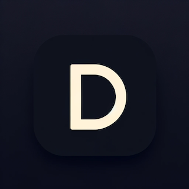

# Directly [](https://directly.streamlit.app)


Directly is a Streamlit app designed to streamline the process of serializing and deserializing project structures. Serialize a project structure to a single text file, or deserialize the text file back to a zipped project structure, directly.

## Features

- **Serialize**: Convert a zipped project structure into a single formatted text file.
- **Deserialize**: Convert a formatted text file back into a zipped project structure.

## Usage

1. Launch the Directly app by visiting [https://directly.streamlit.app](https://directly.streamlit.app).
2. Choose between `Serialize` and `Deserialize` options.
3. For Serialization:
   - Upload a ZIP file containing your project structure.
   - Copy the generated formatted text.
4. For Deserialization:
   - Paste the formatted text into the text area.
   - Download the generated ZIP file containing your project structure.

## Development

Clone the repository:

```bash
git clone https://github.com/yourusername/directly.git
cd directly
